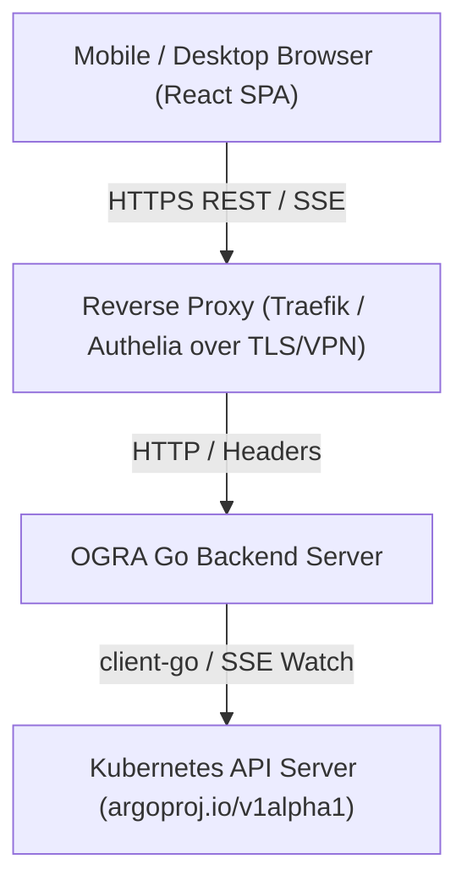

# OGRA — Project Specification & Design Document

## 1. Rationale & Problem Statement

### 1.1 Rationale

Managing Kubernetes workloads and automated pipeline runs on [Argo Workflows](https://argoproj.github.io/workflows/)
frequently requires rapid monitoring and intervention from mobile devices. Traditional web dashboards are often
optimized for desktop displays, requiring heavy resource loading, complex navigation, and poor touch ergonomics.

OGRA addresses this by providing a lightweight, mobile-first web dashboard and unified Go backend API server.
It enables developers and cluster administrators to inspect running pipelines, stream pod logs in real time,
trigger template-based workflows with parameters, and control cron schedules on any screen size.

---

## 2. Key Requirements & Architectural Principles

### 2.1 Functional Requirements

- **Resource Support**: Full support for `Workflow` (W), `WorkflowTemplate` (WT), `ClusterWorkflowTemplate` (CWT),
  and `CronWorkflow` (CrW) resources (`argoproj.io/v1alpha1`). Designed to be extensible for future eventing CRDs
  (EventSources, Sensors).
- **Workflow Operations**: Submit, resubmit, suspend, resume, stop, terminate (kill), retry, and delete workflow runs.
- **Template Execution**: Interactive parameter input forms presenting parameter descriptions, default values,
  and required field validations before submission.
- **Cron Management**: View cron schedules, inspect execution history, manually trigger immediate runs, and toggle
  active/suspended status.
- **Real-Time Log & Event Streaming**: Stream pod log output and cluster state changes via Server-Sent Events (SSE).
- **Mobile & Touch Ergonomics**: Modern dark-mode interface with touch-friendly controls, slide-down filter panels,
  and quick copy-to-clipboard utilities for status messages and log lines.

### 2.2 Architectural Principles

1. **Single-Container Deployment**: A unified Go binary serves both the REST/SSE API endpoints and the static SPA frontend
   bundle, simplifying Kubernetes deployment and reducing operational overhead.
2. **Stateless Operations**: OGRA maintains zero persistent database storage. All cluster state, workflow statuses, and
   logs are queried directly on-demand from the Kubernetes API server.
3. **Upstream Security Model**: OGRA delegates authentication and TLS termination to edge proxies (e.g., Traefik
   with Authelia) over private VPN / Tailscale connections. Downstream requests carry pre-authenticated user headers.

---

## 3. System Architecture

### 3.1 Backend Architecture (`cmd/server/`, `internal/`)

- **Routing**: Built using Go 1.22+ `net/http` pattern matching (`"GET /api/v1/workflows/{namespace}"`,
  `"POST /api/v1/workflows/{namespace}/submit"`).
- **CRD Type Generation**: Derived directly from Argo Workflows CRD OpenAPI v3 schemas (`api/crds/` -> `api/openapi.json`
  -> `internal/api/types.go`).
- **SSE Writer Helper**: Unified `SSEWriter` ([internal/handler/sse.go](file:///Users/davidszakallas/Worktrees/kolobok-origin/ogra/internal/handler/sse.go))
  managing HTTP response headers and chunked flusher logic for events and logs.

### 3.2 Frontend Architecture (`frontend/`)

- **State Consolidation**: Global `ClusterProvider` ([frontend/src/context/ClusterContext.tsx](file:///Users/davidszakallas/Worktrees/kolobok-origin/ogra/frontend/src/context/ClusterContext.tsx))
  centralizes live workflow/template state, SSE stream liveness, and non-blocking toast notifications.
- **Views**:
  - `WorkflowsList`: Filtering by phase, namespace, and name search.
  - `WorkflowDetail`: Multi-tab view presenting Summary, Execution Node Tree, Sequential Timeline, and Pod Log Terminal.
  - `WorkflowTemplates`: Template browser and parameter submission modal.
  - `CronWorkflows` & `CronWorkflowDetail`: Cron schedule monitoring and control.
- **Log Terminal**: Stream viewer with live auto-scroll, pause/resume, search filtering, line wrapping, line-level copy,
  and log file export.

---

## 4. Quality Assurance & E2E Testing

- **API Integration Tests**: Go test suite ([tests/e2e/api/](file:///Users/davidszakallas/Worktrees/kolobok-origin/ogra/tests/e2e/api/))
  executing against a local Kind cluster with automated ephemeral namespace creation and garbage collection.
- **UI Playwright Tests**: Browser test suite ([tests/e2e/ui/](file:///Users/davidszakallas/Worktrees/kolobok-origin/ogra/tests/e2e/ui/))
  validating end-to-end user interactions, form submissions, navigation routes, and namespace isolation.
